# XMO Current Architecture Analysis

Date: 2026-07-09

This document is based on the current source tree, dependency manifests, Flutter entrypoint, service code, backend code, Android native code, tests, and CI files. It does not treat product notes or phase history as implementation truth.

## Source-Based Scope

Primary source files inspected:

- Flutter entry and DI: `lib/main.dart`, `lib/core/app_dependencies.dart`, `lib/config/app_config.dart`
- State and Matrix: `lib/providers/matrix_provider.dart`, `lib/services/matrix_service.dart`, `lib/services/repositories/*`
- E2EE and media: `lib/services/e2ee_service.dart`, `lib/services/matrix_encrypted_media_helper.dart`, `lib/services/matrix_media_helper.dart`, `lib/models/xmo_stream_manifest.dart`, `lib/services/streaming_media_service.dart`, `lib/services/local_playback_proxy_service.dart`, `lib/services/xmo_chunked_media_upload_service.dart`, `lib/services/azure_blob_chunk_storage_service.dart`
- UI flows: `lib/screens/*`, `lib/screens/home/*`, `lib/screens/matrix_chat/*`, `lib/widgets/*`
- Push and calls: `lib/services/push_notification_service.dart`, `lib/services/voip_service.dart`, Android Kotlin notification helpers
- Backend: `auth_server/bin/server.dart`, `auth_server/lib/src/*`, backend handlers
- Build and CI: `pubspec.yaml`, `auth_server/pubspec.yaml`, `android/app/build.gradle.kts`, `.github/workflows/android.yml`

## Folder Structure

```text
xmo/
  lib/
    config/                 dart-define app configuration
    controllers/chat/        small chat controller models
    core/                    AppDependencies inherited scope
    models/                  app models and xmo_stream manifest
    providers/               Provider ChangeNotifier state
    repositories/            thin app repository wrappers
    screens/                 feature screens and large Matrix chat UI
    services/                Matrix, E2EE, media, calls, push, stories, backend clients
    widgets/                 shared UI widgets and media viewers
  auth_server/
    bin/server.dart          Dart HttpServer entrypoint
    lib/src/                 backend services, endpoint modules, handlers
    test/                    backend unit tests
    Dockerfile               compiled Dart server image
  android/                   Flutter Android host plus Kotlin push/call helpers
  ios/                       Flutter iOS host scaffold
  test/                      Flutter unit/widget/service tests
  integration_test/          smoke and real Matrix/E2EE integration tests
  .github/workflows/         Android CI and manual release bundle
```

## Architecture Overview

XMO is a Flutter Matrix client. The app uses Provider/ChangeNotifier state, a singleton `MatrixService` around the Matrix Dart SDK, feature services for media, push, calls, stories, privacy, app lock, and a small Dart backend for OTP, password reset, wallet auth, user directory, Matrix push gateway, donation, and Azure chunk signing.

The current architecture is service-heavy. Repository classes exist, but most domain behavior still goes through `MatrixService` and screen-level orchestration. E2EE relies on the Matrix SDK for Olm/Megolm/cross-signing/key backup and adds a custom encrypted media helper to avoid native `libcrypto.so` media failures. Large encrypted video streaming is partially implemented through optional `xmo_stream` manifests, encrypted chunks, a local loopback range proxy, quality variants, and optional Azure Blob chunk storage.

## 1. High-Level System Architecture

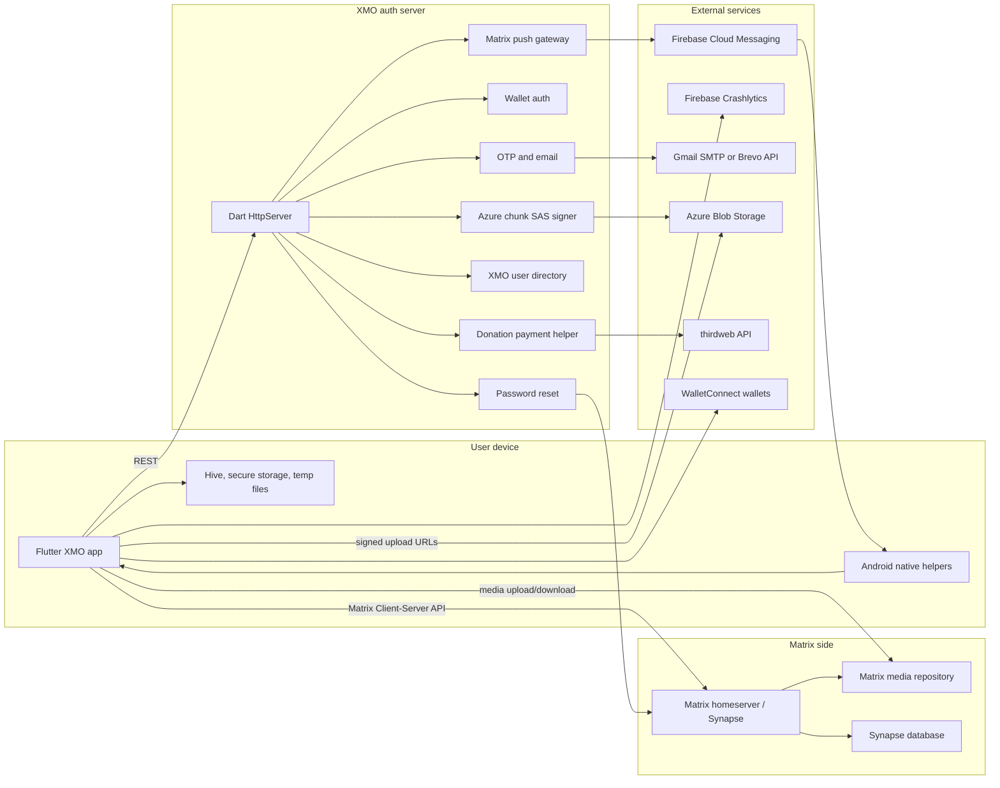

## 2. Flutter Application Architecture

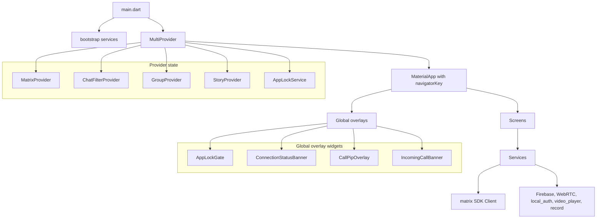

## 3. Matrix Integration Architecture

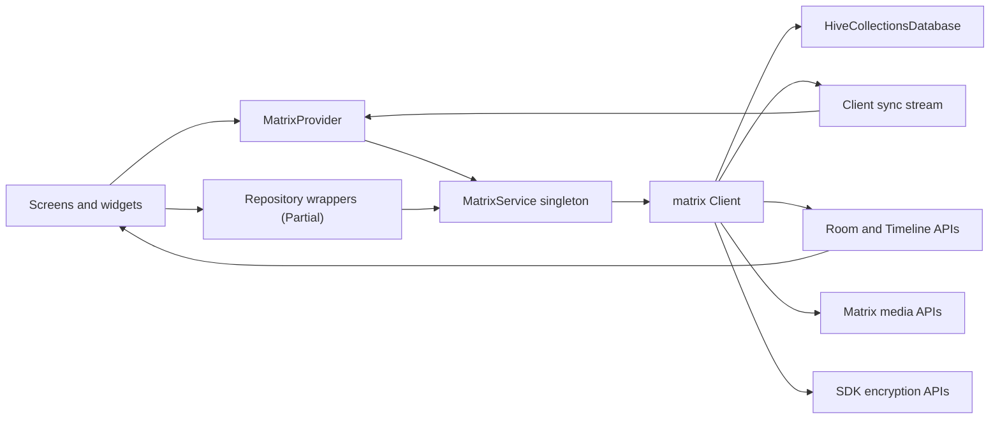

## 4. Authentication Flow Diagram

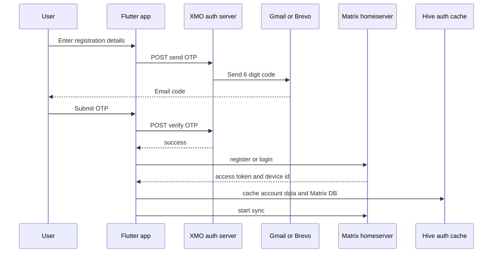

Wallet auth is parallel:

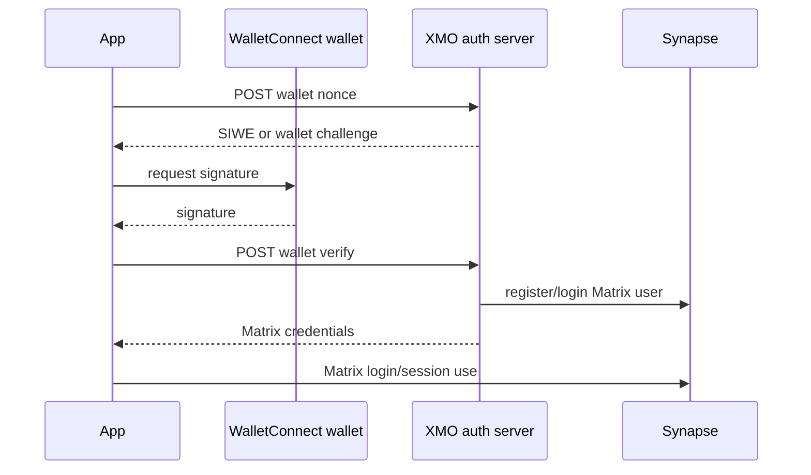

Password reset is backend-mediated through verified email and Synapse admin APIs.

## 5. End-to-End Encryption Flow

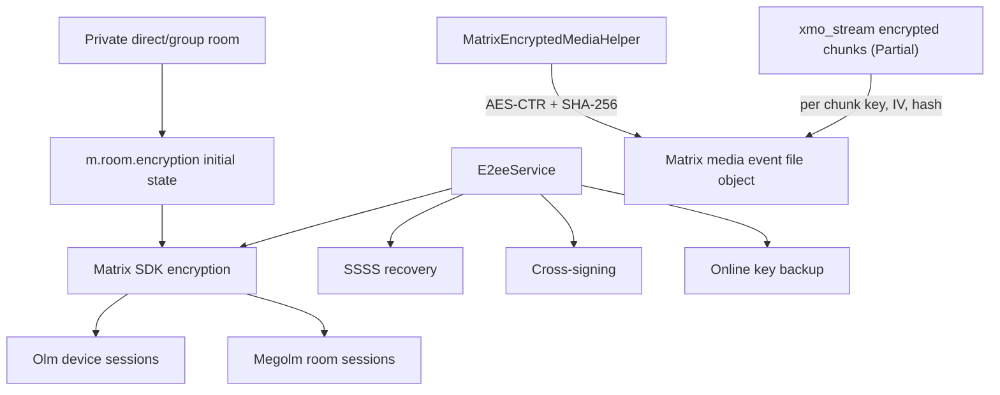

Status: E2EE is implemented through the SDK and helper services, but production proof remains partial. The app has setup/unlock/request-secret flows; full two-device, Element interop, restore-after-reinstall, and verified-device key request proof should remain release blockers.

## 6. Message Send and Receive Sequence

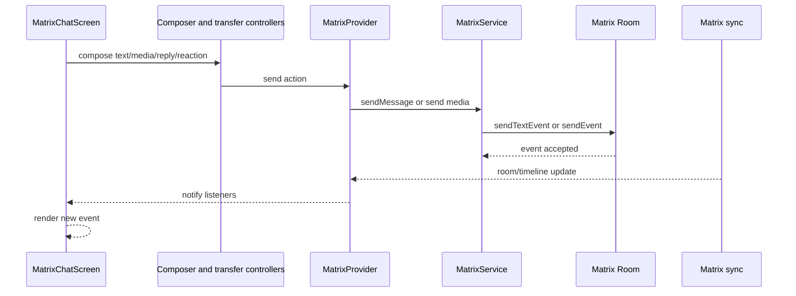

## 7. Media Upload and Download Flow

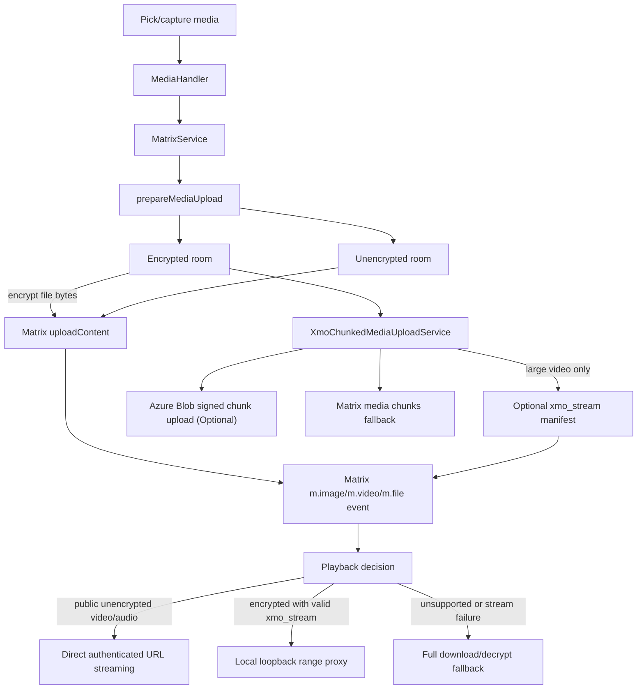

## 8. Push Notification Flow

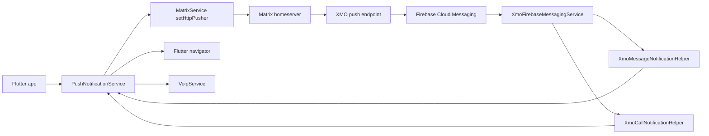

## 9. Voice and Video Call Architecture

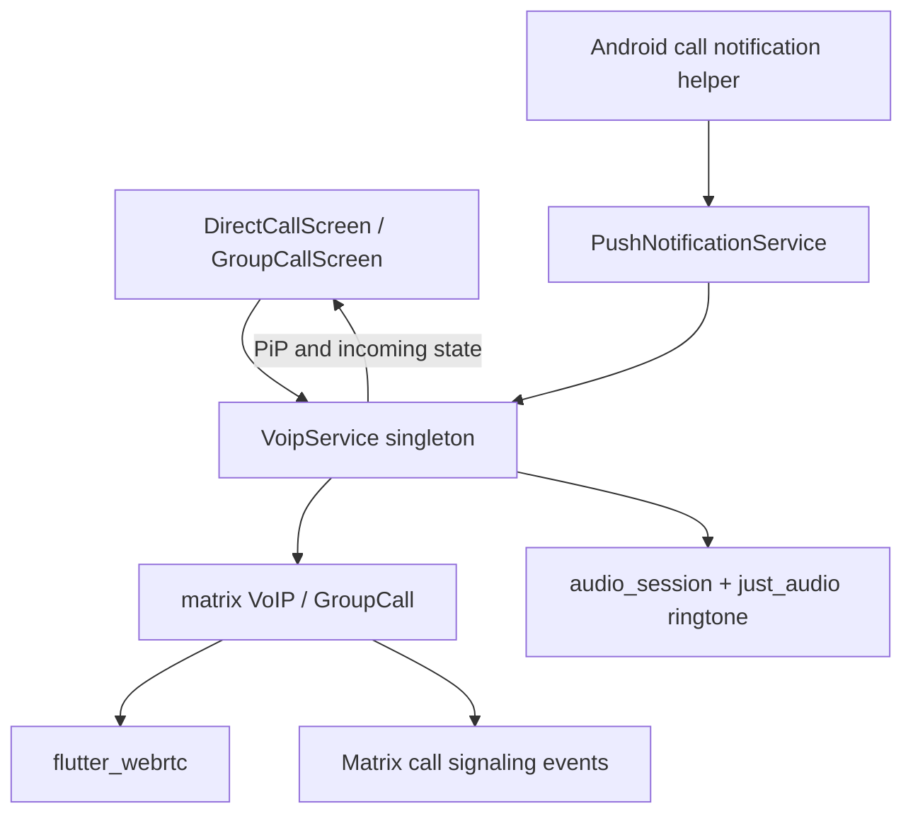

Call media is WebRTC transport encrypted. It is not Matrix Olm/Megolm E2EE. Call signaling and push metadata remain visible to the Matrix/push infrastructure.

## 10. Database and Storage Diagram

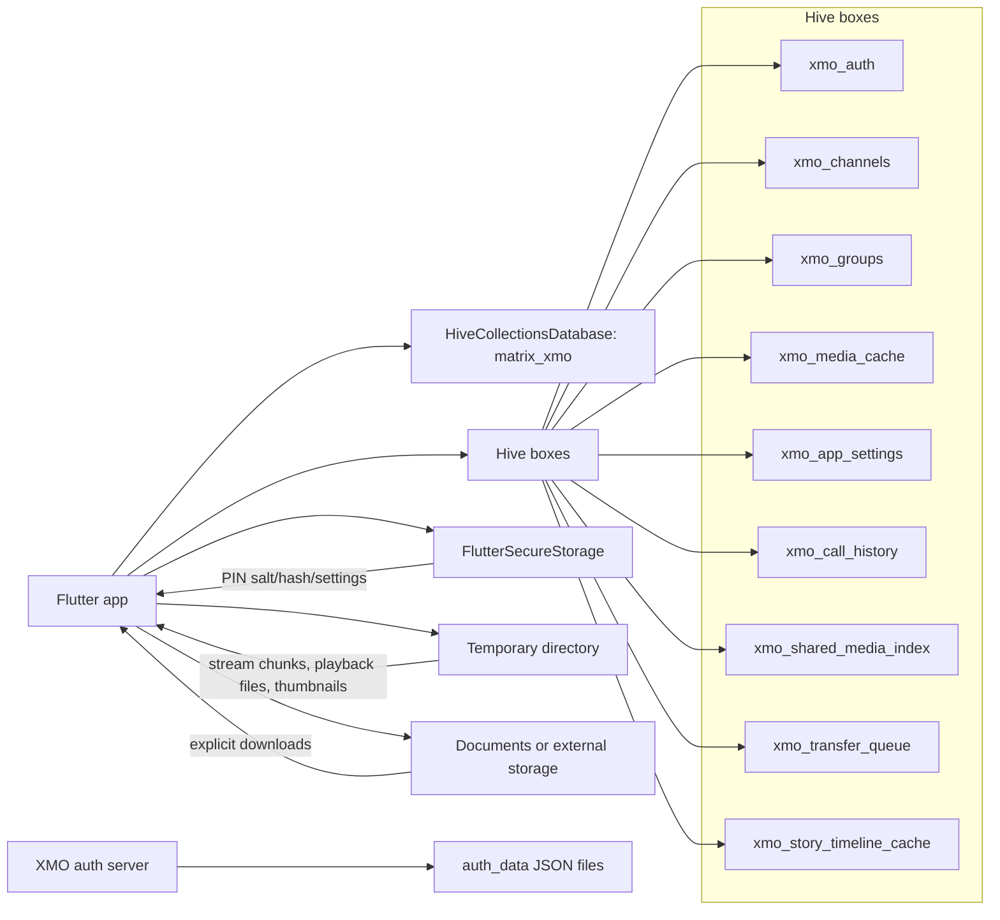

## 11. Networking Layer Diagram

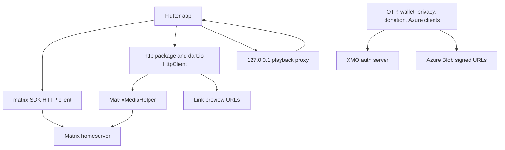

Matrix media credentials are supplied with `Authorization: Bearer` headers through `MatrixMediaHelper`; access tokens are stripped from media query strings.

## 12. Service Dependency Diagram

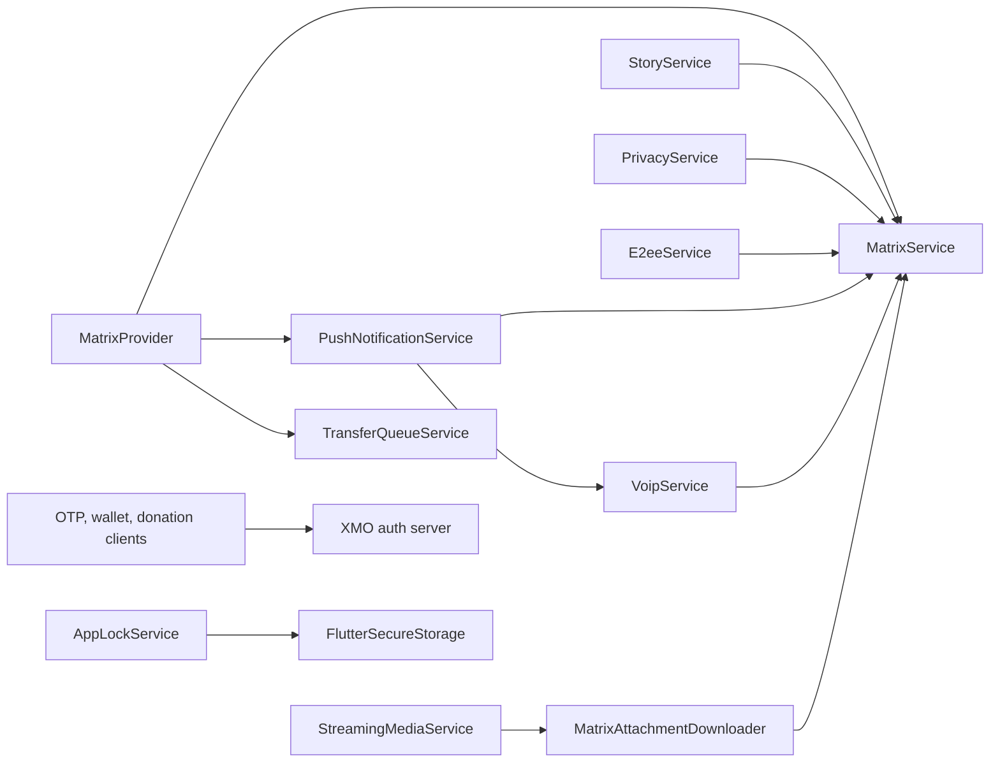

## 13. State Management Diagram

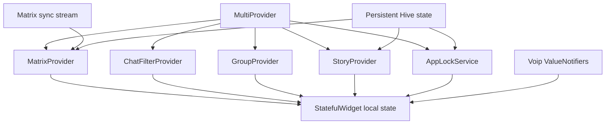

## 14. Infrastructure Diagram

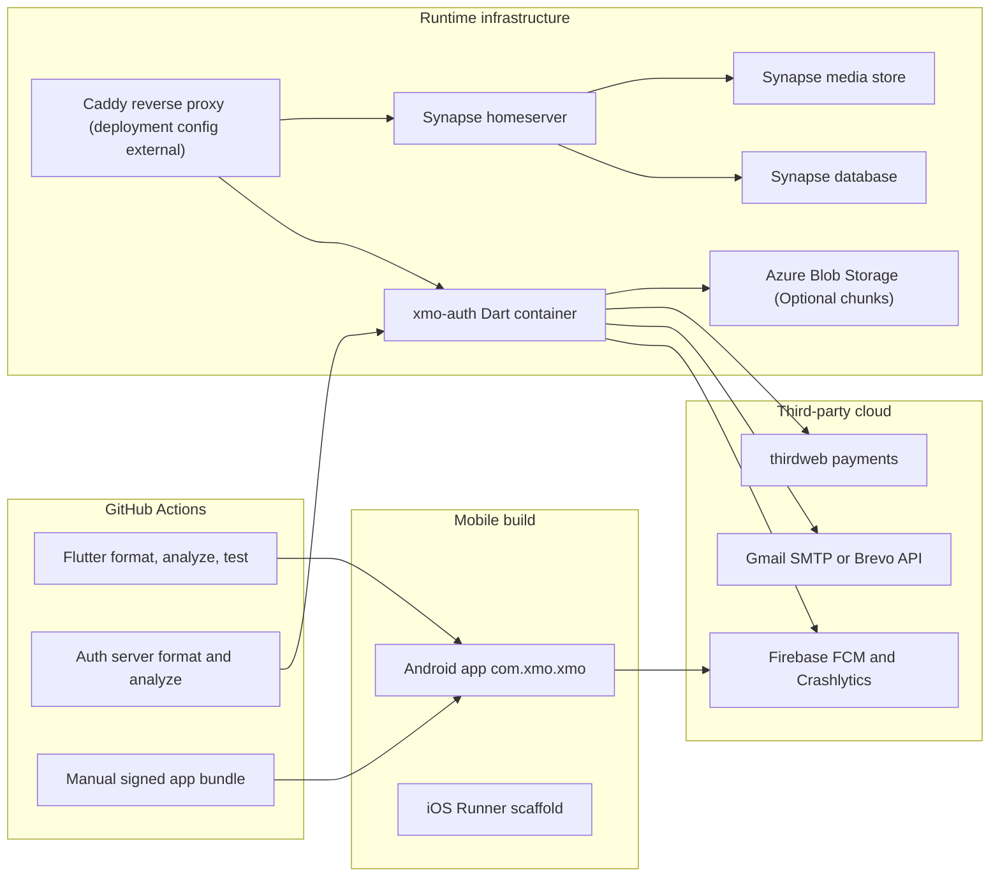

The repository contains the auth server Dockerfile and app CI. The full VPS compose/Caddy/Synapse deployment config is not fully represented in the repo source tree inspected here.

## 15. Complete Component Relationship Diagram

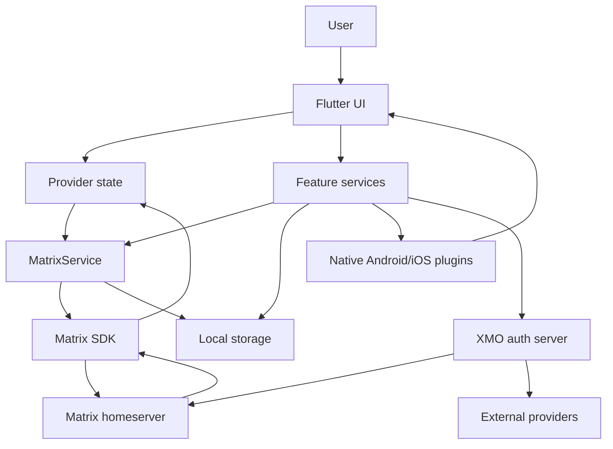

## Layer-by-Layer Explanation

### Presentation Layer

Screens under `lib/screens` implement most user workflows. Navigation is imperative with `Navigator.push`, `pushReplacement`, and `MaterialPageRoute`; there is no declarative router package. `MatrixChatScreen` remains a large central screen with extracted widgets/controllers around it.

### State Layer

Provider is the primary app state mechanism. `MatrixProvider` owns login/sync state and exposes rooms. `ChatFilterProvider`, `GroupProvider`, `StoryProvider`, and `AppLockService` provide feature state. `VoipService` uses `ValueNotifier`s for call overlays and PiP.

### Service Layer

`MatrixService` is the main service and Matrix SDK adapter. It handles auth, profile, room creation, room kind classification, saved messages, pushers, messaging, media upload, public directory, and sync access. Additional services handle privacy, stories, app lock, call history, transfers, media streaming, wallet auth, OTP, donations, device sessions, and settings.

### Repository Layer

There are repository classes and contracts for auth/session, room, media, push, and groups/channels. They mostly delegate to `MatrixService`, so this is a partial abstraction rather than a fully separated domain/data architecture.

### Backend Layer

`auth_server` is a compiled Dart `HttpServer`. It has endpoint modules for route matching and handlers for:

- OTP send/verify
- Password reset and Matrix admin password update
- Wallet nonce/verify
- Donations via thirdweb
- FCM push forwarding for Matrix pusher events
- Azure Blob chunk SAS signing
- Exact XMO user directory search and upsert
- Health status

### Native Layer

Android Kotlin handles Firebase message interception, foreground/background notification behavior, message notifications, call notifications, call answer/decline/open events, and visibility tracking. Flutter uses platform channels/event channels for notification and call actions.

## Component Responsibilities

- `MatrixProvider`: authentication state, sync listener, room list refresh, saved messages readiness, pusher registration.
- `MatrixService`: Matrix SDK facade and largest app coordinator.
- `E2eeService`: recovery setup, SSSS unlock, cross-signing/key backup status, verified-device key requests.
- `MatrixEncryptedMediaHelper`: Matrix encrypted attachment AES-CTR encrypt/decrypt and SHA-256 verification without native OpenSSL.
- `MatrixMediaHelper`: authenticated Matrix media URL construction with bearer headers.
- `MediaHandler`: chat media picking, thumbnail/image cache, authenticated media downloads.
- `StreamingMediaService`: validates stream manifests, downloads/verifies/decrypts chunks, writes temp chunk cache.
- `LocalPlaybackProxyService`: loopback HTTP server with range requests for video player seeking.
- `XmoChunkedMediaUploadService`: splits large video, creates per-chunk encrypted upload manifest, adds quality variants.
- `AzureBlobChunkStorageService`: asks backend for signed upload URLs and PUTs encrypted chunks.
- `PushNotificationService`: FCM setup, Matrix pusher registration, notification routing, native action handling.
- `VoipService`: Matrix VoIP/group calls, WebRTC coordination, ringtone, PiP, call screens.
- `StoryService`: story account data, direct-room story update events, local story cache.
- `PrivacyService`: privacy account data, Matrix directory room fallback, backend exact `@username` directory.
- `AppLockService`: PIN hash, biometric unlock, lifecycle locking, secure storage.

## External Dependencies

Key Flutter dependencies:

- `matrix`, `flutter_olm`
- `provider`, `hive`, `hive_flutter`, `flutter_secure_storage`
- `firebase_core`, `firebase_messaging`, `firebase_crashlytics`, `flutter_local_notifications`
- `flutter_webrtc`, `webrtc_interface`, `audio_session`, `just_audio`
- `video_player`, `video_compress`, `video_thumbnail`, `record`, `camera`, `image_picker`, `file_picker`
- `reown_appkit`, `url_launcher`, `http`, `crypto`, `bs58`

Backend dependencies:

- `http`, `mailer`, `crypto`, `cryptography`, `web3dart`, `googleapis_auth`, `bs58`

External runtime providers:

- Matrix homeserver/Synapse
- Firebase FCM and Crashlytics
- Gmail SMTP or Brevo Email API
- thirdweb API
- WalletConnect-compatible wallet apps
- Azure Blob Storage for optional encrypted stream chunks

## Security Boundaries

- Matrix access tokens live inside the app/Matrix SDK state and are used in Authorization headers for Matrix media and pusher operations.
- Media URLs avoid access token query parameters.
- Matrix room event encryption is SDK-managed for encrypted rooms.
- Matrix media encryption uses encrypted file metadata and AES-CTR/SHA-256 helper code.
- `xmo_stream` chunks use per-chunk keys, IVs, and hashes; chunks are encrypted before Matrix/Azure storage.
- Local loopback proxy exposes decrypted media only on `127.0.0.1` with random session tokens and stops when sessions close.
- App lock PIN hash/salt/settings are stored in `flutter_secure_storage`; biometric auth delegates to platform APIs.
- Backend secrets stay in environment variables: email credentials/API keys, Firebase service account, thirdweb key, wallet auth secret, Synapse admin token, Azure account key.
- Backend user directory upsert verifies Matrix bearer token with Synapse `whoami`.
- Azure Blob endpoint returns signed URLs; Flutter does not hold Azure account keys.

## Data Flow Explanation

Login/register starts in Flutter, goes through OTP or wallet backend when used, then uses Matrix Client-Server APIs for Matrix session creation/login. Once logged in, `MatrixProvider` starts sync, registers push, loads rooms from Matrix SDK state, and notifies UI.

Messages are sent through `MatrixService` to Matrix rooms. Receive path is Matrix sync -> `MatrixProvider` -> UI. Media sends use Matrix media upload plus Matrix message events. Encrypted rooms encrypt media before upload. Large encrypted videos may additionally add `xmo_stream`; if unsupported, existing Matrix media fields remain valid.

Push notifications are generated by Synapse through the Matrix pusher URL, received by the XMO backend, forwarded to FCM, then handled by native Android helpers and Flutter routing code.

Stories are saved as Matrix account data for the current user and broadcast as custom events to direct chat rooms that are allowed by privacy rules.

## Performance Bottlenecks

- `MatrixService` and `MatrixChatScreen` are still very large and coordinate many unrelated responsibilities.
- Chat media thumbnail generation, video metadata, and encrypted media handling can be CPU and disk heavy.
- Full Matrix encrypted media fallback still downloads/decrypts the whole file before playback.
- Link preview fetches happen during send and can add latency, although timeouts exist.
- Story broadcasting loops across direct rooms.
- User directory fallback through Matrix custom room events can be slow until backend entries are synced.
- Local chunk streaming uses temp files and local HTTP; it is safer than full memory load but still disk and battery intensive.
- Video compression before upload can be expensive on low-end devices.

## Scalability Concerns

- `auth_server` stores OTP and reset codes in memory. Restart loses pending codes. Backend user directory/password reset can persist to JSON files when configured, but this is not a scalable database.
- Rate limiting is in-process; it does not scale horizontally.
- Matrix room/search scalability depends heavily on Synapse configuration.
- Azure chunk signing is present, but chunk lifecycle/deletion policy is not handled in app code.
- Public user directory exact search is intentionally narrow; broader username discovery would need indexed backend storage.
- Transfer queues are local-device only and do not coordinate across devices.

## Missing Production Components

- Full production E2EE verification evidence remains missing: two XMO devices, XMO to Element, recovery restore after reinstall, verified key requests, and cross-signing reliability.
- Backend persistence should move from memory/JSON files to a real database if scaled.
- Backend structured logs exist, but centralized log retention/alerting is not in repo.
- No analytics SDK was found. Channel statistics screen exists, but no Firebase Analytics dependency exists.
- No MiniApp/WebView architecture was found. Files named `web_video_view` are video playback helpers, not a MiniApp system.
- Public/private group/channel type changes have been constrained in UI, but server-side enforcement is Matrix state/power-level based and should be audited further for all edge cases.
- Azure Blob signed URL expiry and blob cleanup/lifecycle policy are operational concerns outside the repo.
- Backend analyzer has previously timed out in this environment; CI has an analyzer job, but local reliability remains a concern.

## Future Architecture

Planned or partial items that should stay separate from current architecture:

- Fully production-proven E2EE with device verification evidence.
- Full adaptive encrypted media streaming rollout for all sizes. Current implementation is strongest for large encrypted video with fallback.
- CDN in front of Azure Blob. No CDN code/config was found.
- Horizontal backend deployment with shared database/rate limiter.
- First-class MiniApp architecture. No implementation found.
- Analytics/event instrumentation. No analytics dependency found.

## Architecture Quality Score

Current score: 6.5 / 10

Strengths:

- Uses Matrix SDK and Matrix-compatible event fields instead of replacing Matrix protocol behavior.
- Token-safe media helper avoids access tokens in URLs.
- E2EE uses Matrix SDK primitives and custom media crypto avoids native `libcrypto.so` failures.
- Push, call notifications, and routing have native Android integration.
- Large media streaming is additive and has fallback paths.
- Tests exist for several critical model/service layers.

Weaknesses:

- Central services and screens remain too large.
- Backend persistence and rate limiting are not production-scale.
- E2EE is implemented but not fully proven operationally.
- Several features depend on custom Matrix event conventions without formal migration/version strategy beyond current manifest validation.
- App architecture mixes UI, domain decisions, and Matrix calls in screens and services.

## Recommendations

1. Split `MatrixService` by ownership: auth/session, rooms, messaging, media, push, directory, and E2EE adapters.
2. Continue moving `MatrixChatScreen` behavior into controllers/widgets with tests.
3. Keep all custom media streaming additive. Never remove normal Matrix media fields.
4. Add a real backend datastore for OTP/reset/user directory and rate limiting before broad public release.
5. Add integration tests for encrypted media, chunk streaming fallback, seek/cancel, push routing, and call notifications.
6. Add an operational E2EE evidence checklist to release gates.
7. Add Azure lifecycle policies and observability for signed URL/chunk errors.
8. Add CI coverage for Android release builds with required dart-defines and signing variables.
9. Harden local cache cleanup and encrypted temp file retention rules.
10. Keep public rooms unencrypted by design and make private/public immutable at creation to avoid Matrix E2EE downgrade/upgrade confusion.

## Release Test Checklist

- Register/login with OTP, wallet auth, password reset, logout, delete account.
- Search exact `@username`, public group, and public channel.
- Create private group/channel and confirm E2EE state.
- Create public group/channel and confirm it is searchable and not E2EE.
- Send/receive text, replies, reactions, edits/deletes, polls, stickers, files.
- Send/receive encrypted image, video, audio, voice, PDF.
- Open public unencrypted video via URL streaming.
- Open encrypted video with `xmo_stream`; seek, cancel, close, reopen.
- Confirm Matrix fallback opens when `xmo_stream` is missing or invalid.
- Confirm Element can read fallback Matrix media.
- Confirm media auth headers work and no access token query URLs are emitted.
- Test FCM foreground, background, killed-from-recents, locked screen, and notification tap route.
- Test incoming direct call, group call, answer/decline/open from notification.
- Test recovery setup, key backup restore, cross-signing, verified-device key requests.
- Test app lock PIN, biometrics, lifecycle lock, failed attempt blocking.
- Run Flutter tests and backend tests in CI and on local machine before release.
